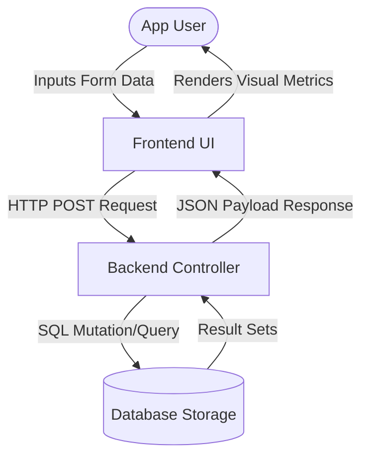

# 16. Data Flow Diagram (DFD)

```mermaid
graph TD
    User([App User]) -->|Inputs Form Data| Client[Frontend UI]
    Client -->|HTTP POST Request| Server[Backend Controller]
    Server -->|SQL Mutation/Query| DB[(Database Storage)]
    DB -->|Result Sets| Server
    Server -->|JSON Payload Response| Client
    Client -->|Renders Visual Metrics| User
```
